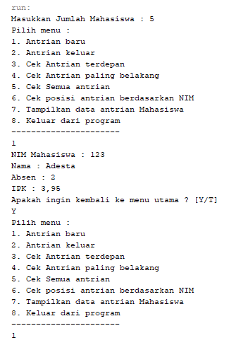
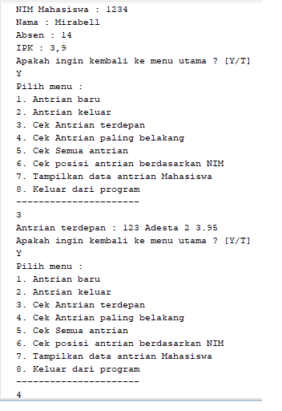
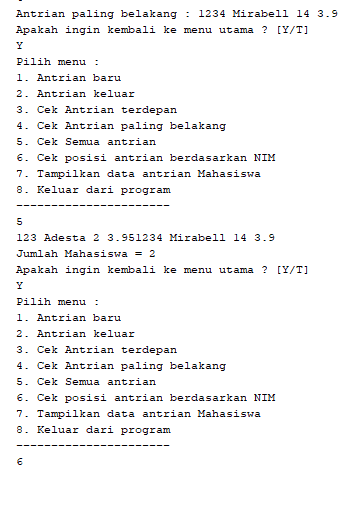
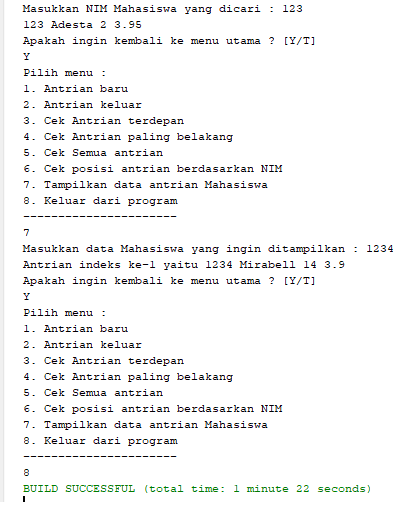

# Laporan Praktikum QUEUE
oleh Bima Putra W - 2141720255
TI-1G_08

## 8.2.3 Pertanyaan
1. Pada konstruktor, mengapa nilai awal atribut front dan rear bernilai -1, sementara atribut size
bernilai 0?
• Karena atribut front dan rear tidak menunjuk ke data manapun, sedangkan size merupakan 
banyaknya nilai yang diinputkan ke dalam array 
2. Pada method Enqueue, jelaskan maksud dan kegunaan dari potongan kode berikut!
• Apabila posisi rear sudah mencapai indeks terakhir array, maka posisi rear akan mengulang ke 
indeks 0 lagi.
3. Pada method Dequeue, jelaskan maksud dan kegunaan dari potongan kode berikut!
• Apabila posisi front sudah mencapai indeks terakhir array, maka posisi front akan mengulang 
ke indeks 0 lagi.
4. Pada method print, mengapa pada proses perulangan variabel i tidak dimulai dari 0 (int i=0),
melainkan int i=front?
• Karena pada indeks 0 belum tentu front serta konsep queue yang dulu masuk berarti yang 
dulu keluar, bisa saja yang baru masuk itu terletak pada indeks ke 0 karena kondisi 
Ketika data paling belakang dari queue berada di indeks terakhir array, maka diaturlah 
perulangan yang dimulai dari front
5. Perhatikan kembali method print, jelaskan maksud dari potongan kode berikut!
• Potongan kode di atas digunakan agar i tidak melebihi max 
6. Tunjukkan potongan kode program yang merupakan queue overflow!
if (isFull()){
    System.out.println)(x; "Queue sudah penuh");
}
7. Pada saat terjadi queue overflow dan queue underflow, program tersebut tetap dapat berjalan dan 
hanya menampilkan teks informasi. Lakukan modifikasi program sehingga pada saat terjadi queue overflow dan queue underflow, program dihentikan!
public class QueueMain {
    public static void menu(){
        System.out.println("Masukkan operasi yang diinginkan: ");
        System.out.println("1. Enqueue");
        System.out.println("2. Dequeue");
        System.out.println("3. Print");
        System.out.println("4. Peek");
        System.out.println("5. Peek Position");
        System.out.println("6. Peek At");
        System.out.println("7. Clear");
        System.out.println("-------------------------");
    }

    public static void main(String[] args) {
        Scanner sc = new Scanner(System.in);
        System.out.print("Masukkan kapasitas queue: ");
        int n = sc.nextInt();
        Queue Q = new Queue(n);
        int pilih;
        String ulang;
        do{
            menu();
            pilih = sc.nextInt();
            switch (pilih){
                case 1:
                    System.out.print("Masukkan data baru: ");
                    int dataMasuk = sc.nextInt();
                    Q.Enqueue(dataMasuk);
                    break;
                case 2:
                    int dataKeluar = Q.Dequeue();
                    if (dataKeluar != 0){
                        System.out.println("Data yang dikeluarkan: " + dataKeluar);
                        break;
                    }
                case 3:
                    Q.print();
                    break;
                case 4:
                    Q.peek();
                    break;
                case 5:
                    System.out.print("Masukkan data yang ingin dicari: ");
                    int data = sc.nextInt();
                    Q.peekPosition(data);
                    break;
                case 6:
                    System.out.println("Masukkan posisi index yang ingin dicari: ");
                    int position = sc.nextInt();
                    Q.peekAt(position);
                    break;
                case 7:
                    Q.clear();
                    break;
                case 8:
                    System.exit(0);
                default:
                    System.out.println("Maaf, anda salah memasukkan menu pilihan");
            }
            System.out.println("Apakah ingin kembali ke menu utama? [y/t]");
            ulang = sc.next();
        } while(ulang.equalsIgnoreCase("y"));
        //while (pilih == 1 || pilih == 2 || pilih == 3 || pilih == 4 || pilih == 5 || pilih == 6 || pilih == 7);
    }
}

## 8.3.3 Pertanyaan
1. Pada class QueueMain, jelaskan fungsi IF pada potongan kode program berikut!
Jawab:
• Kode program di atas digunakan untuk mengecek apakah norek, nama, alamat, umur, saldo 
kosong atau tidak, apabila salah satu dari kelima atribut tersebut ada yang kosong maka tidak 
akan menampilkan antrian yang keluar 
2. Lakukan modifikasi program dengan menambahkan method baru bernama peekRear pada class
Queue yang digunakan untuk mengecek antrian yang berada di posisi belakang! Tambahkan pula
daftar menu 5. Cek Antrian paling belakang pada class QueueMain sehingga method 
peekRear dapat dipanggil!
 public void peekRear (){
    if (!IsEmpty()){
        System.out.println("Elemen paling belakang: " + data[rear].norek + " " + data[rear].nama + " " + data[rear].alamat + " " + data[rear].umur + " " + data[rear].saldo);
    } else {
        System.out.println("Queue masih kosong");
    }
}
public static void menu(){
    System.out.println("Pilih menu: ");
    System.out.println("1.Antrian baru");
    System.out.println("2. Antrian keluar");
    System.out.println("3. Cek Antrian terdepan");
    System.out.println("4. Cek Semua Antrian");
    System.out.println("5. Cek Antrian paling belakang");
    System.out.println("----------------------------");
}
public static void main(String[] args) {
    Scanner sc = new Scanner(System.in);
    System.out.print("Masukkan kapasitas queue: ");
    int jumlah = sc.nextInt();
    NasabahQueue antri = new NasabahQueue(jumlah);
    int pilih;

    do {
        menu();
        pilih = sc.nextInt();
        sc.nextLine();
        switch (pilih){
            case 1:
                System.out.println("No rekening: ");
                String norek = sc.nextLine();
                System.out.println("Nama: ");
                String nama = sc.nextLine();
                System.out.println("Alamat: ");
                String alamat = sc.nextLine();
                System.out.println("Umur: ");
                int umur = sc.nextInt();
                System.out.println("Saldo: ");
                double saldo = sc.nextDouble();
                Nasabah nb = new Nasabah(norek, nama, alamat, umur, saldo);
                sc.nextLine();
                antri.Enqueue(nb);
                break;
            case 2:
                Nasabah data = antri.Dequeue();
                if (!"".equals(data.norek) && !"".equals(data.nama) && !"".equals(data.alamat) && data.umur != 0 && data.saldo != 0){
                    System.out.println("Antrian yang keluar: " + data.norek + " " + data.nama + " " + data.alamat + " " + data.umur + " " + data.saldo);
                    break;
                }
            case 3:
                antri.peek();
                break;
            case 4:
                antri.print();
                break;
            case 5:
                antri.peekRear();
                break;
        }
    } while (pilih == 1 || pilih == 2 || pilih == 3 || pilih == 4 || pilih == 5);
}

## Latihan Praktikum

public void peekPosition(int dataDicari) {
    int i = front;
    int posisi = 1;
    System.out.print("Data " + dataDicari + " berada pada posisi index ke-");
    while(i != rear) {
        if (data[i]==dataDicari){
            System.out.print(posisi + " ");
        }
        i = (i+1) % max;
        posisi++;
    }
    if (data[i] == dataDicari){
        System.out.print(posisi + " ");
    }
    System.out.println();
}

public void peekAt(int position) {
    int idxDicari = front;
    System.out.print("Data yang berada pada index ke-" + position + " adalah : ");
    for (int i = 0 ; i < position - 1 ; i++){
        idxDicari = (idxDicari + 1) % max;
    }
    System.out.println(data[idxDicari] + " ");
}

### hasil run 

