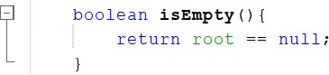
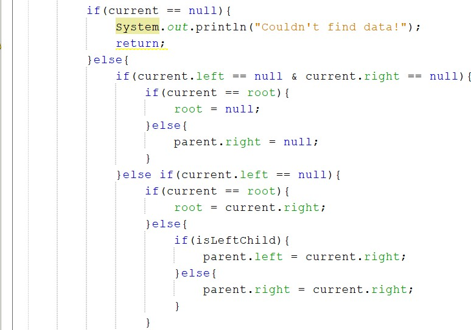
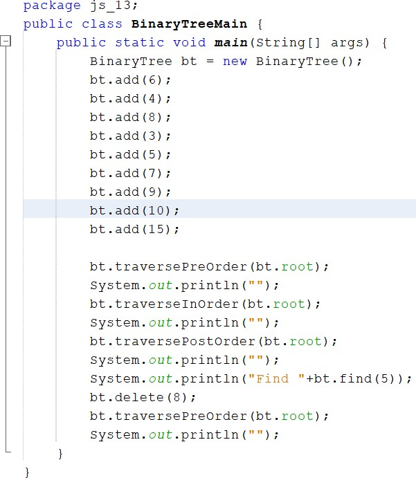
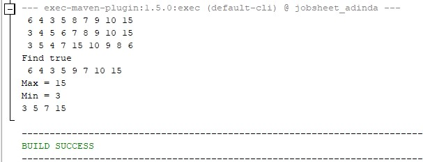
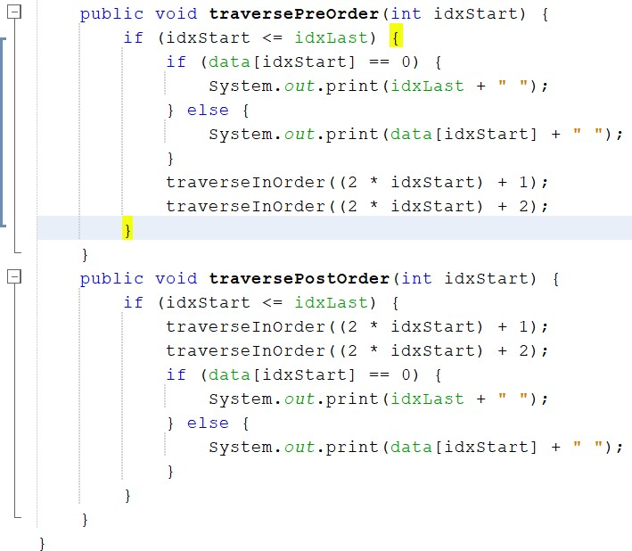

# JOBSHEET 14 TREE
Bima Putra Wicaksono
1G_08_2141720255

2.1 Implementasi Binary Search Tree menggunakan Linked List 
2.1.1 Tahapan percobaan

1. Buatlah class Node, BinaryTree dan BinaryTreeMain 
2. Di dalam class Node, tambahkan atribut data, left dan right, serta konstruktor default dan berparameter.

3. Di dalam class BinaryTree, tambahkan atribut root

4. Tambahkan konstruktor default dan method isEmpty() di dalam class BinaryTree

5. Tambahkan method add() di dalam class BinaryTree. Di bawah ini proses penambahan node tidak dilakukan secara rekursif, agar lebih mudah dilihat alur proses penambahan 
node dalam tree. Sebenarnya, jika dilakukan dengan proses rekursif, penulisan kode 
akan lebih efisien.

6. Tambahkan method find()

7. Tambahkan method traversePreOrder(), traverseInOrder() dan traversePostOrder(). 
Method traverse digunakan untuk mengunjungi dan menampilkan node-node dalam tree, baik dalam mode pre-order, in-order maupun post-order.

8. Tambahkan method getSuccessor(). Method ini akan digunakan ketika proses 
penghapusan node yang memiliki 2 child.

9. Tambahkan method delete().
Di dalam method delete tambahkan pengecekan apakah tree kosong, dan jika tidak cari posisi node yang akan di hapus.

Kemudian tambahkan proses penghapusan terhadap node current yang telah ditemukan.

10. Buka class BinaryTreeMain dan tambahkan method main()

11. Compile dan jalankan class BinaryTreeMain untuk mendapatkan simulasi jalannya 
program tree yang telah dibuat.

12. Amati hasil running tersebut.

2.1.2 Pertanyaan Percobaan

1. Mengapa dalam binary search tree proses pencarian data bisa lebih efektif dilakukan 
dibanding binary tree biasa?
• Karena pada binary search tree semua anak disebelah kiri (left-child) harus lebih kecil 
daripada anak disebelah kanan (right-child) dan parentnya, sedangkan binary tree biasa 
tidak. Binary search tree adalah binary tree yang seluruh children dari tiap node terurut 
sehingga dalam pencarian data jauh lebih efektif dari awal sampai akhir.
2. Untuk apakah di class Node, kegunaan dari atribut left dan right?
• Digunakan untuk menyimpan index. Dimana left untuk menyimpan index yang 
nilainya lebih kecil dari root, sedangkan right untuk menyimpan index yang nilainya 
lebih besar dari root.
3. a. Untuk apakah kegunaan dari atribut root di dalam class BinaryTree? 
• Untuk menentukan node pertama yang dibuat dalam tree yang tidak memiliki 
predessesor dan juga sebagai penunjukan
b. Ketika objek tree pertama kali dibuat, apakah nilai dari root?
• Nilai root ketika objek tree pertama kali dibuat adalah bernilai null atau kosong.
4. Ketika tree masih kosong, dan akan ditambahkan sebuah node baru, proses apa yang 
akan terjadi?
• Proses yang akan terjadi adalah proses add dimana node baru tersebut langsung masuk 
dan menjadi root dalam sebuah tree
5. Perhatikan method add(), di dalamnya terdapat baris program seperti di bawah ini. 
Jelaskan secara detil untuk apa baris program tersebut?

• Ketika data kurang dari current.data kemudian current.left tidak bernilai null, maka 
akan dilakukan current = current.left dan apabila current.left bernilai null, maka proses 
yang dilakukan current.left = new Node(data) atau penambahan node baru dan break 
(berhenti).
2.2 Implementasi binary tree dengan array
2.2.1 Tahapan Percobaan
1. Di dalam percobaan implementasi binary tree dengan array ini, data tree disimpan 
dalam array dan langsung dimasukan dari method main(), dan selanjutnya akan 
disimulasikan proses traversal secara inOrder.
2. Buatlah class BinaryTreeArray dan BinaryTreeArrayMain
3. Buat atribut data dan idxLast di dalam class BinaryTreeArray. Buat juga method populateData() dan traverseInOrder().

4. Kemudian dalam class BinaryTreeArrayMain buat method main
() seperti gambar 
berikut ini.

5. Jalankan class BinaryTreeArrayMain dan amati hasilnya!

13.2.1 Pertanyaan Percobaan
1. Apakah kegunaan dari atribut data dan idxLast yang ada di class BinaryTreeArray?
• Data untuk menyimpan data dan idxLast untuk menyimpan batas data saat dilakukan 
print out
2. Apakah kegunaan dari method populateData()?
• Fungsi dari method populateData() adalah untuk menyimpan data yang dimasukkan 
atau untuk atribut data dan idxLast
3. Apakah kegunaan dari method traverseInOrder()?
• Fungsi dari method traverseInOrder() adalah untuk mencetak / menampilkan data 
dengan InOrder
4. Jika suatu node binary tree disimpan dalam array indeks 2, maka di indeks berapakah 
posisi left child dan rigth child masin-masing?
• Left child dari node tersebut akan berada di index 2i + 1. Right child dari node tersebut 
akan berada di index 2i + 2. Maka left child berada pada index ke-5 dan right child 
berada index ke 6
5. Apa kegunaan statement int idxLast = 6 pada praktikum 2 percobaan nomor 4?
• Fungsi dari statement int idxLast = 6 adalah untuk menentukan batas melakukan print 
dengan batas indeks yaitu 6
13.3 Tugas Praktikum
1. Buat method di dalam class BinaryTree yang akan menambahkan node dengan cara rekursif.

2. Buat method di dalam class BinaryTree untuk menampilkan nilai paling kecil dan yang 
paling besar yang ada di dalam tree.

OUTPUT

3. Buat method di dalam class BinaryTree untuk menampilkan data yang ada di leaf.

OUTPUT

4. Buat method di dalam class BinaryTree untuk menampilkan berapa jumlah leaf yang 
ada di dalam tree.

OUTPUT

5. Modifikasi class BinaryTreeArray, dan tambahkan : 
• method add(int data) untuk memasukan data ke dalam tree

• method traversePreOrder() dan traversePostOrder()

OUTPUT

