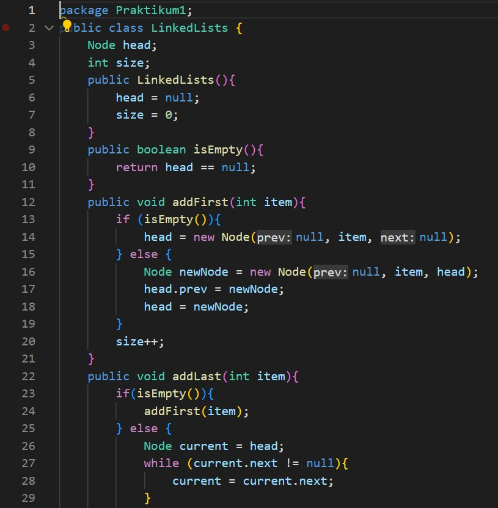
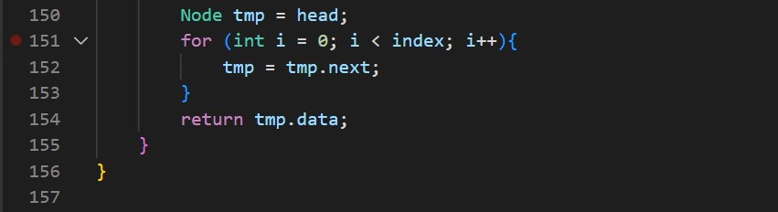

# JOBSHEET XII GRAPH 
Bima Putra Wicaksono
2141720255

2.1	Implementasi Graph menggunakan Linked List
2.1.1	Tahapan Percobaan
Pada percobaan ini akan diimplementasikan Graph menggunakan Linked Lists untuk merepresentasikan graph adjacency. Silakan lakukan langkah-langkah praktikum sebagai berikut.
1.	Buatlah class Node, dan class Linked Lists sesuai dengan praktikum Double Linked Lists

2.	Tambahkan class Graph yang akan menyimpan method-method dalam graph dan juga method main()
3.	Di dalam class Graph, tambahkan atribut vertex bertipe integer dan list[] bertipe LinkedList

4.	Tambahkan konstruktor default untuk menginisialisasi variabel vertex dan menambahkan perulangan untuk jumlah vertex sesuai dengan jumlah length array yang telah ditentukan.

5.	Tambahkan method addEdge(). Jika yang akan dibuat adalah graph berarah, maka yang dijalankan hanya baris pertama saja. Jika graph tidak berarah yang dijalankan semua baris pada method addEdge().
 
6.	Tambahkan method degree() untuk menampilkan jumlah derajat lintasan pada suatu vertex. Di dalam metode ini juga dibedakan manakah statement yang digunakan untuk graph berarah atau graph tidak berarah. Eksekusi hanya sesuai kebutuhan saja.

7.	Tambahkan method removeEdge(). Method ini akan menghapus lintasan ada suatu graph. Oleh karena itu, dibutuhkan 2 parameter untuk menghapus lintasan yaitu source dan destination
 
8.	Tambahkan method removeAllEdges() untuk menghapus semua vertex yang ada di dalam graph.
 
9.	Tambahkan method printGraph() untuk mencatak graph ter-update
 
10.	Compile dan jalankan method main() dalam class Graph untuk menambahkan beberapa edge pada graph, kemudian tampilkan. Setelah itu keluarkan hasilnya menggunakan pemanggilan method main(). Keterangan: degree harus disesuaikan dengan jenis graph yang telah dibuat (directed/undirected).
 
11.	Amati hasil running tersebut
12.	Tambahkan pemanggilan method removeEdge() sesuai potongan code di bawah ini pada method main(). Kemudian tampilkan graph tersebut.

13.	Amati hasil running tersebut.
14.	Uji coba penghapusan lintasan yang lain! Amati hasilnya!
 
2.1.2	Verifikasi Hasil Percobaan
Hasil Running Langkah ke-11

Hasil Running Langkah ke-13
 
2.1.3	Pertanyaan Percobaan
1.	Sebutkan beberapa jenis (minimal 3) algoritma yang menggunakan dasar Graph, dan apakah kegunaan algoritma-algoritma tersebut?
Algoritma yang menggunakan dasar graph yaitu :
1.	BFS digunakan sebagai algoritma pencarian
2.	DFS digunakan sebagai algoritma pencarian
3.	Algoritma Hopcroft-Karp digunakan untuk menemukan penjodohan maksimum
2.	Pada class Graph terdapat array bertipe LinkedList, yaitu LinkedList list[]. Apakah tujuan pembuatan variabel tersebut ?
Melakukan pemanggilan fungsi linked list dan mengisi list yang berupa vartex pada linked list tersebut
3.	Apakah alasan pemanggilan method addFirst() untuk menambahkan data, bukan method add jenis lain pada linked list ketika digunakan pada method addEdge pada class Graph?
 
Untuk menambah data yang dimulai dari awal untuk menghubungkan vertex dengan koneksinya
4.	Bagaimana cara mendeteksi prev pointer pada saat akan melakukan penghapusan suatu edge pada graph ?
Dengan melakukan looping vertex. Jadi, jika vertex lebih besar dari (i) dan destination sama dengan (i) maka akan dilihat source dari I dan edge akan otomatis dihapus
5.	Kenapa pada praktikum 2.1.1 langkah ke-12 untuk menghapus path yang bukan merupakan lintasan pertama kali menghasilkan output yang salah ? Bagaimana solusinya ?
Output yang dikeluarkan tidak error namun data vertex yang dilewati mengalami perubahan path / lintasan
2.2	Implementasi Graph menggunakan Matriks
2.2.1	Tahapan Percobaan
Pada praktikum 2 ini akan diimplementasikan Graph menggunakan matriks untuk merepresentasikan graph adjacency. Silakan lakukan langkah-langkah praktikum sebagai berikut.
1.	Uji coba graph bagian 2 menggunakan array 2 dimensi sebagai representasi graph. Buatlah class graphArray yang didalamnya terdapat variabel vertices dan array twoD_array!
 
2.	Buatlah konstruktor graphArray sebagai berikut!
 
3.	Untuk membuat suatu lintasan maka dibuat method makeEdge() sebagai berikut.
 
Untuk menampilkan suatu lintasan diperlukan pembuatan method getEdge() berikut.

4.	Kemudian buatlah method main() seperti berikut ini
 
5.	Jalankan class graphArray dan amati hasilnya!

  
2.2.2	Verifikasi Hasil Percobaan
 
2.2.3	Pertanyaan Percobaan
1.	Apakah perbedaan degree/derajat pada directed dan undirected graph?
Pada directed graph degree mempengaruhi bobot pada edge antar vertex (bobotnya tidak sama antara A ke B dan B ke A). Sedangkan undirected graph degree tidak mempengaruhi bobot (bobot antara A ke B dan B ke A nilai bobotnya sama). Jika pada directed graph degree nya bisa berbeda untuk derajat in dan out nya ,pada undirected maka degree nya sama
2.	Pada implementasi graph menggunakan adjacency matriks. Kenapa jumlah vertices harus ditambahkan dengan 1 pada indeks array berikut?
 
Karena vertex dimasukkan ke dalam matriks sedangkan pada matriks indeks pertama dimulai dari 0. Maka, agar vertex dalam matrix sama dengan vertex yang aslinya harus di +1. Dan juga karena untuk menabahkan nilai vertex berikutnya
3.	Apakah kegunaan method getEdge() ?
Unutk menampilkan apakah vertex tersedia atau tidak di dalam graph
4.	Termasuk jenis graph apakah uji coba pada praktikum 2.2?
Adjacency Matrix Directed Graph
5.	Mengapa pada method main harus menggunakan try-catch Exception ?
Untuk menangani proses penanganan error agar program tetap berjalan meskipun ada error serta agar tidak terjadi bug
