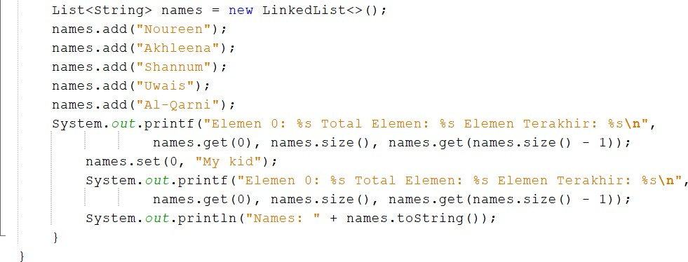
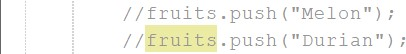

# Collection
Bima Putra Wicaksono
1G_08_2141720255

16.2.	Kegiatan Praktikum 1
16.2.1.	Percobaan 1
Pada percobaan 1 ini akan dicontohkan penggunaan collection untuk menambahkan sebuah elemen, mengakses elemen, dan menghapus sebuah elemen.
1.	Buatlah sebuah class ContohList yang main methode berisi kode program seperti di bawah ini

2.	Tambahkan kode program untuk menggunakan collection dengan aturan penulisan kode program seperti berikut

16.2.2.	Verifikasi Hasil Percobaan
 
16.2.3.	Pertanyaan Percobaan
1.	Perhatikan baris kode 25-36, mengapa semua jenis data bisa ditampung ke dalam sebuah Arraylist?
•	Karena dalam tipe data tersebut tidak ada kurung siku yang menyatakan tipe data apa yang bisa disimpan. Sehingga bisa menyimpan atau menampung semua jenisa data
2.	Modifikasi baris kode 25-36 seingga data yang ditampung hanya satu jenis atau spesifik tipe tertentu!
•	Class

3.	Ubah kode pada baris kode 38 menjadi seperti ini

•	Jawab
 
4.	Tambahkan juga baris berikut ini, untuk memberikan perbedaan dari tampilan yang sebelumnya
 
•	Class
 
5.	Dari penambahan kode tersebut, silakan dijalankan dan apakah yang dapat Anda jelaskan!
•	Hasil Running

Pada tambahan kode program di atas terjadi penambahan data yaitu data Mei-mei
16.3.	Kegiatan Praktikum 2
16.3.1.	Tahapan Percobaan
Pada praktikum 2 ini akan dibuat beberapa method untuk menampilkan beberapa cara yang dapat dilakukan untuk mengambil/menampilkan elemen pada sebuah collection. Silakan ikutilah Langkah-langkah di bawah ini
1.	Buatlah class dengan nama LoopCollection serta tambahkan method main yang isinya adalah sebagai berikut
 
2.	Tambahkan potongan kode berikut ini dari yang sebelumnya agar proses menampilkan elemen pada sebuah stack bervariasi.
 
 
16.3.2.	Verifikasi Hasil Percobaan

16.3.3.	Pertanyaan Percobaan
1.	Apakah perbedaan fungsi push() dan add() pada objek fruits?
•	Jika push akan menggunakan sistem LIFO yaitu Last In First Out. Jika add tidak. Untuk fungsinya sama, yaitu sama-sama menambahkan objek, push dimiliki oleh class stack, sedangakan add ada pada interface / ada pada listnya
2.	Silakan hilangkan baris 43 dan 44, apakah yang akan terjadi? Mengapa bisa demikian?

•
Ketika dilakukan run, maka yang terjadi adalah data melon dan durian tidak muncul di output karena kedua data tersebut tidak dimasukkan atau tidak berada di dalam stack
3.	Jelaskan fungsi dari baris 46-49?
•	Berfungsi menampilkan isi dari stack tersebut dengan melakukan looping / perulangan
4.	Silakan ganti baris kode 25, Stack menjadi List dan apakah yang terjadi? Mengapa bisa demikian?
 
•	Akan terjadi error pada kode program. Karena pada class tersebut menggunakan method yang ada di dalam collection Stack, bukan collection List
5.	Ganti elemen terakhir dari dari objek fruits menjadi “Strawberry”!
•	Class

•	Output
 
6.	Tambahkan 3 buah seperti “Mango”,”guava”, dan “avocado” kemudian dilakukan sorting!
•	Class

•	Output
 
 
16.4.	Kegiatan Praktikum 3
16.4.1.	Tahapan Percobaan
Pada praktikum 3 ini dilakukan uji coba untuk mengimplementasikan sebuah collection untuk menampung objek yang dibuat sesuai kebutuhan. Objek tersebut adalah sebuah objek mahasiswa dengan fungsi-fungsi umum seperti menambahkan, menghapus, mengubah, dan mencari.
1.	Buatlah sebuah class Mahasiswa dengan attribute, kontruktor, dan fungsi sebagai berikut
 
2.	Selanjutnya, buatlah sebuah class ListMahasiswa yang memiliki attribute seperti di bawah ini
 
3.	Method tambah(), hapus(), update(), dan tampil() secara berurut dibuat agar bisa melakukan operasi-operasi seperti yang telah disebutkan
 
4.	Untuk proses hapus, update membutuhkan fungsi pencarian terlebih dahulu yang potongan kode programnya adalah sebagai berikut
 
 
5.	Pada class yang sama, tambahkan main method seperti potongan program berikut dan amati hasilnya!
 
16.4.2.	Verifikasi Hasil Percobaan

16.4.3.	Pertanyaan Percobaan
1.	Pada fungsi tambah() yang menggunakan unlimited argument itu menggunakan konsep apa? Dan kelebihannya apa?
•	Menggunakan kelebihannya yaitu dapat mengambil argument tanpa batas tertentu dan memiliki parameter lebih dari satu
2.	Pada fungsi linearSearch() di atas, silakan diganti dengan fungsi binarySearch() dari collection!
•	Import collection
 
 
•	Menambahkan class MhsComparator

•	Tambah kode program di ListMahasiswa
 
3.	Tambahkan fungsi sorting baik secara ascending ataupun descending pada class tersebut!
•	Method asc dan desc pada class ListMahasiswa
 
•	Pemanggilan methode asc dan desc pada ListMahasiswa

•	Output
 
