# Laporan Praktikum JOBSHEET 2 (OBJEK)

oleh Bima Putra W - 2141720255

## 2.2 Deklarasi Class, Atribut dan method

### 2.2.1 Kode Program

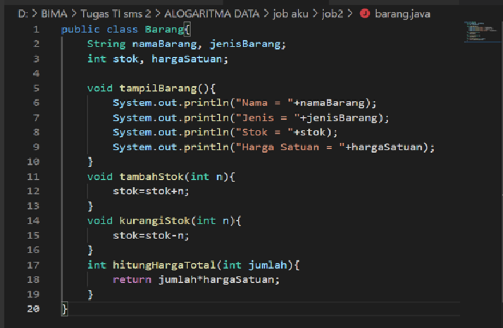

### 2.2.2 Verifikasi Hasil Percobaan

### 2.2.3 Jawab Pertanyaan

1. Sebutkan 2 karakteristik class/objek!
    Atribut : identitas(informasi) dari suatau objek yang juga disebut sebagai variabel.
    method  : tindakan yang dapat dilakukan terhadap suatu objek (Behavior)
2. Kata kunci apakah yang digunakan untuk mendeklarasikan class?
    Menggunakan deklarasi "class" diikuti nama kelas tersebut
    contoh  : class Java {}
3. Perhatikan class Barang yang ada di Praktikum di atas, ada berapa atribut yang dimiliki oleh class 
tersebut? Sebutkan! Dan pada baris berapa saja deklarasi atribut dilakukan?
    Terdapat 4 atribut class Barang tadi
    yaitu   : namaBarang, jenisBarang, stok, hargaSatuan.
              Atribut tersebut berada pada baris ke 2 sampai 13
4. Ada berapa method yang dimiliki oleh class tersebut? Sebutkan! Dan pada baris berapa saja 
deklarasi method dilakukan?
    ada 4 Method, yaitu tampilBarang, tampilStok,, kurangStok, hitungHargaTotal.
    Deklarasi method terdapat di baris ke 16 sampai 29
5. Perhatikan method kurangiStok() yang ada di class Barang, modifikasi isi method tersebut 
sehingga proses pengurangan hanya dilakukan jika stok masih ada (masih lebih besar dari 0)
    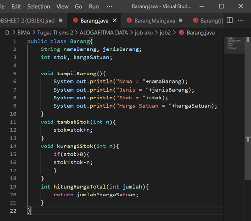
6. Menurut Anda, mengapa method tambahStok() dibuat dengan memiliki 1 parameter berupa 
bilangan int?
    Dikarenakan Tipe Integer adalah data numerik yang hanya bisa digunakan dengan bilangan bulat.
    tipe Integer digunakan karena memiliki cakupan nilai yang besar.
7. Menurut Anda, mengapa method hitungHargaTotal() memiliki tipe data int?
    Dikarenakan Tipe Integer adalah data numerik yang hanya bisa digunakan dengan bilangan bulat.
    tipe Integer digunakan karena memiliki cakupan nilai yang besar.
8. Menurut Anda, mengapa method tambahStok() memiliki tipe data void?
    Karena method tersebut hanya diperlukan untuk menghitung tanpa perlu dikembalikan (return)
    kepada pemanggil.
## 2.3 Instasiasi Objek dan Mengakses Atribut & Method

### 2.3.1 Kode Program

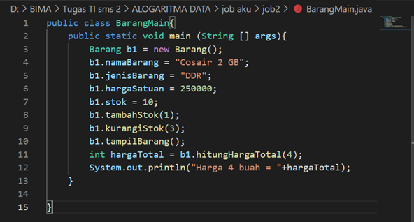

### 2.3.2 Verifikasi Hasil Percobaan

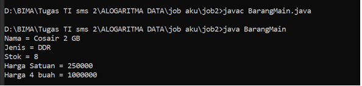

### 2.3.3 Jawab Pertanyaan

1. Pada class BarangMain, pada baris berapakah proses instansiasi dilakukan? Dan apa nama objek 
yang dihasilkan?
    instansiasi dilakukan pada baris ke 3
    nama objek yang dihasilakan adalah Barang
2. Bagaimana cara mengakses atribut dan method dari suatu objek?
    dapat diakses dengan instansiasi

## 2.4 Membuat Konstruktor

### 2.4.1 Kode Program

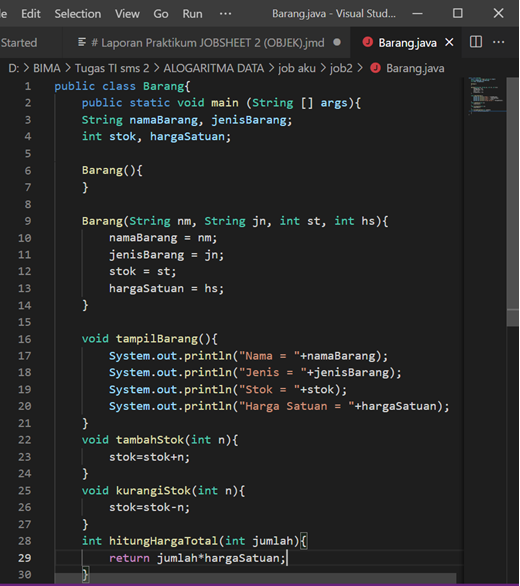
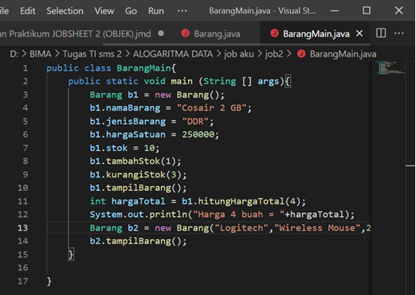

### 2.4.2 Verifikasi Hasil Percobaan

### 2.4.3 Jawab Pertanyaan

1. Perhatikan class Barang yang ada di Praktikum 2.4.1, pada baris berapakah deklarasi 
konstruktor berparameter dilakukan?
    Pada baris ke 6
2. Perhatikan class BarangMain di Praktikum 2.4.1, apa sebenarnya yang dilakukan pada baris 
program dibawah ini?
    Program tersebut adalah proses instansiasi
3. Coba buat objek dengan nama b3 dengan menggunakan konstruktor berparameter dari class 
Barang
    Barang3 b3 = new Barang3 ("Parfum", "Kosmetik", 7, 15000);

## 2.5 Latihan Praktikum

### 1 Kode Program

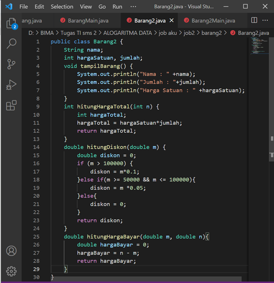
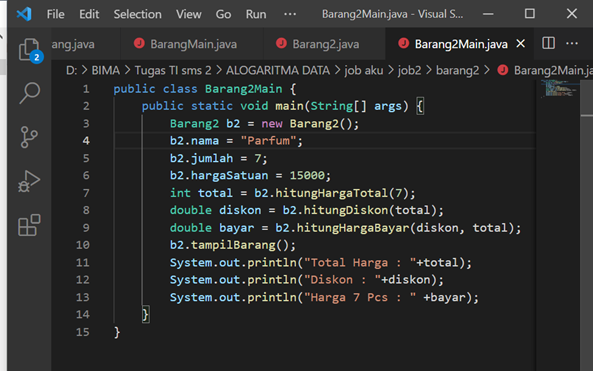

### 1.2 Verifikasi Hasil Percobaan

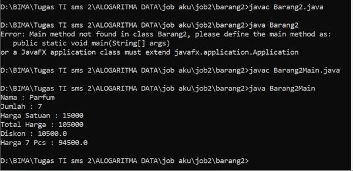

### 2 Kode Program

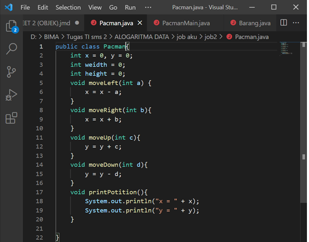
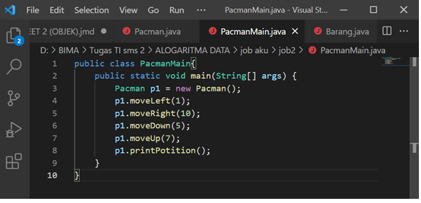

### 2.2 Verifikasi Hasil Percobaan

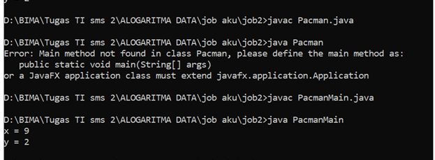