# Laporan Praktikum JOBSHEET 3 (ARRAY OF OBJEK)

oleh Bima Putra W - 2141720255
TI-1G_08

## 3.2 Membuat Array dari Object, Mengisi dan Menampilkan

### 3.2.1 Kode Program 

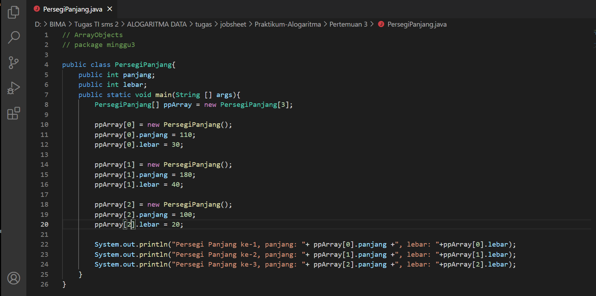

### 3.2.2 Verifikasi Hasil Percobaan

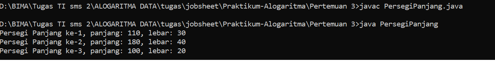

### 3.2.3 Jawab Pertanyaan

1. Berdasarkan uji coba 3.2, apakah class yang akan dibuat array of object harus selalu memiliki atribut dan sekaligus method? Jelaskan!
    menurut saya objek harus selalu memiliki atribut, tapi tidak harus memiliki method. pada percobaan 3.2 harus
    memasukkan panjang dan lebar dan itu adalah atribut dari objek tersebut.
2. Apakah class PersegiPanjang memiliki konstruktor? Jika tidak, kenapa dilakukan pemanggilan konstruktur pada baris program berikut :
    digunakan untuk pembuatan objek PersegiPanjang ke index array 1
3. Apa yang dimaksud dengan kode berikut ini:
    Untuk membuat ppArray bisa berisikan 3 objek PersegiPanjang
4. Apa yang dimaksud dengan kode berikut ini:
    Untuk instansiasi objek, kemudian membuat objek PersegiPanjang index array1
    dan mengisi atribut array index1 dengan panjang :80 dan lebar :40
5. Mengapa class main dan juga class PersegiPanjang dipisahkan pada uji coba 3.2?
    supaya lebih fleksibel dan bisa lebih memunculkan class dan objek tersebut
    
## 3.3 Menerima Input Isian Array Menggunakan Looping

### 3.3.1 Kode Program 

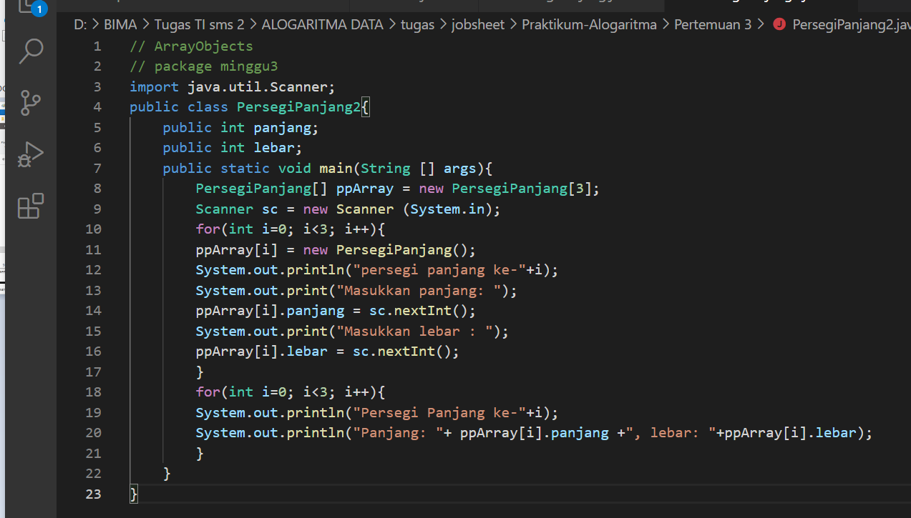

### 3.3.2 Verifikasi Hasil Percobaan

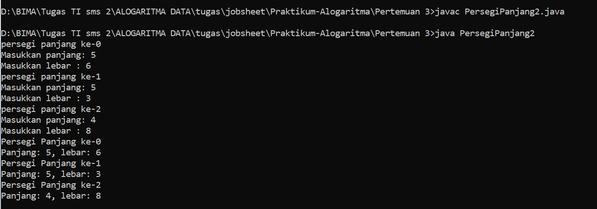

### 3.3.3 Jawab Pertanyaan

1. Apakah array of object dapat diimplementasikan pada array 2 Dimensi?
    bisa
2. Jika jawaban soal no satu iya, berikan contohnya! Jika tidak, jelaskan!
     ```java
     projek [][] m = new projek[1][1];
     p[0][0] = new projek();
     ```  
3. Jika diketahui terdapat class Persegi yang memiliki atribut sisi bertipe integer, maka kode 
dibawah ini akan memunculkan error saat dijalankan. Mengapa?
    Karena belum membuat objek pada index array5. Seharusnya setelah line 1 berisi
    ``` java
    plArray[5] = new Persegi();
    ```  
4. Modifikasi kode program pada praktikum 3.3 agar length array menjadi inputan dengan Scanner!
     ``` java
    Scanner input = new Scanner(System.in);
    System.out.print("Masukkan panjang array : ");
    int arrLength = input.nextInt();
    PersegiPanjang[] ppArray = new PersegiPanjang[arrLength];
    ```
5. Apakah boleh Jika terjadi duplikasi instansiasi array of objek, misalkan saja instansiasi dilakukan 
pada ppArray[i] sekaligus ppArray[0]?Jelaskan !
    Boleh, saya telah menginsatnsiasi objek ip[0] = new ipkKamus(); secara berkali-kali dan hasilnya tidak terjadi
    error.

## 3.4 Operasi Matematika Atribut Object Array

### 3.4.1 Kode Program 

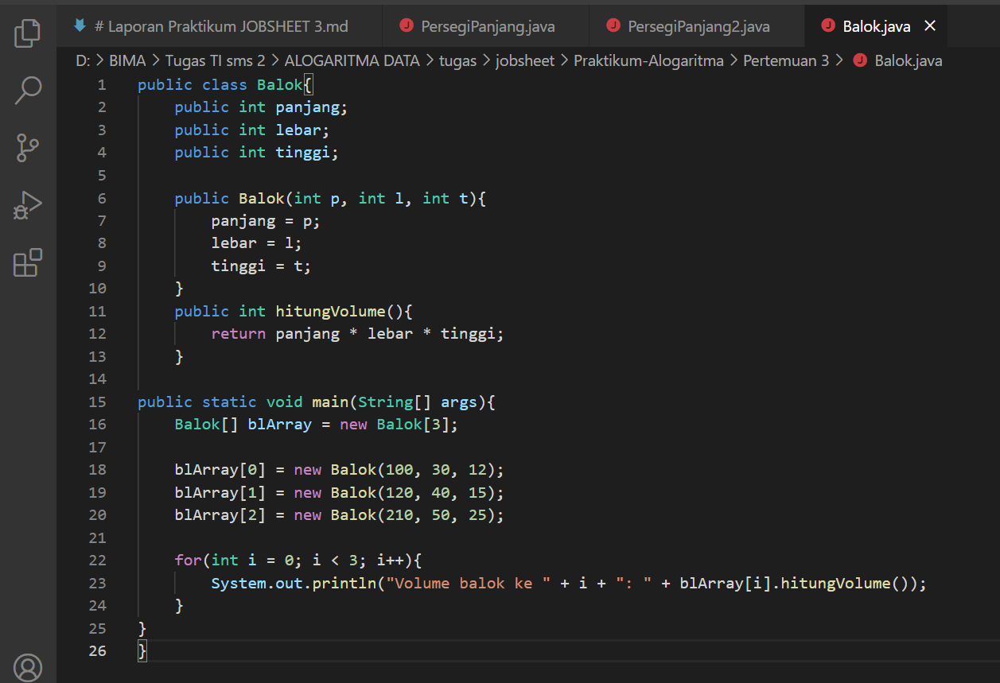

### 3.4.2 Verifikasi Hasil Percobaan

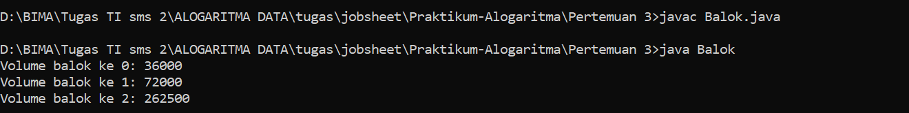

### 3.4.3 Jawab Pertanyaan

1. Dapatkah konstruktor berjumlah lebih dalam satu kelas?  Jelaskan dengan contoh!
        Bisa  
    ``` java
    public class Contoh{
        int isi;
        public Contoh(){

        }
        public Contoh(int i) {
            isi = i;
        }
    }
    ```
    konstruktor berparameter dan konstruktor tidak berparameter

2. Jika diketahui terdapat class Segitiga seperti berikut ini:
Tambahkan konstruktor pada class Segitiga tersebut yang berisi parameter int a, int t
yang masing-masing digunakan untuk mengisikan atribut alas dan tinggi.   

    ``` java
    public class Segitiga{
        public int alas;
        public int tinggi;
        
        public Segitiga(int a, int t){
            alas = a;
            tinggi = t;
        }
    }
    ```
3. Tambahkan method hitungLuas() dan hitungKeliling() pada class Segitiga
tersebut.

     ``` java
    public class Segitiga{
        public int alas;
        public int tinggi;
        
        public Segitiga(int a, int t){
            alas = a;
            tinggi = t;
        }

        int hitungLuas(){
            return alas*tinggi/2;
        }

        double hitungKeliling(){
            double keliling = Math.sqrt(((alas*1/2)*(alas*1/2))+(tinggi*tinggi))*2+alas;
        }
    }
    ``` 
4. Pada fungsi main, buat array Segitiga sgArray yang berisi 4 elemen, isikan masing-masing 
atributnya sebagai berikut:
sgArray ke-0 alas: 10, tinggi: 4
sgArray ke-1 alas: 20, tinggi: 10
sgArray ke-2 alas: 15, tinggi: 6
sgArray ke-3 alas: 25, tinggi: 10

    ``` java
        public class SegitigaMain{
            public static void main (String[] args) {
                Segitiga[] sgArray = new Segitiga[4];
                
                for (int i = 0 ; i < sgArray.length ; i++) {
                    sgArray[i] = new Segitiga(); 
                }
                sgArray[0].alas = 10;
                sgArray[0].tinggi = 4;
                sgArray[1].alas = 20;
                sgArray[1].tinggi = 10;
                sgArray[2].alas = 15;
                sgArray[2].tinggi = 6;
                sgArray[3].alas = 25;
                sgArray[3].tinggi = 10;
            }
        }
    ```
5. Kemudian menggunakan looping, cetak luas dan keliling dengan cara memanggil method 
hitungLuas() dan hitungKeliling().
    ``` java
        public class SegitigaMain{
            public static void main (String[] args) {
                Segitiga[] sgArray = new Segitiga[4];

                for (int i = 0 ; i < sgArray.length ; i++) {
                    sgArray[i] = new Segitiga();
                }
                sgArray[0].alas = 10;
                sgArray[0].tinggi = 4;
                sgArray[1].alas = 20;
                sgArray[1].tinggi = 10;
                sgArray[2].alas = 15;
                sgArray[2].tinggi = 6;
                sgArray[3].alas = 25;
                sgArray[3].tinggi = 10;

                for (int i = 0 ; i < sgArray.length ; i++) {
                    System.out.println("Luas Segitiga ke -" + (i+1) + " adalah : " + sgArray[i].hitungLuas());
                    System.out.println("Keliling Segitiga ke -" + (i+1) + " adalah : " + sgArray[i].hitungKeliling());
                }
            }
        }

    ```

## 3.5 Latihan Praktikum

### 1. Kode Program 
bola
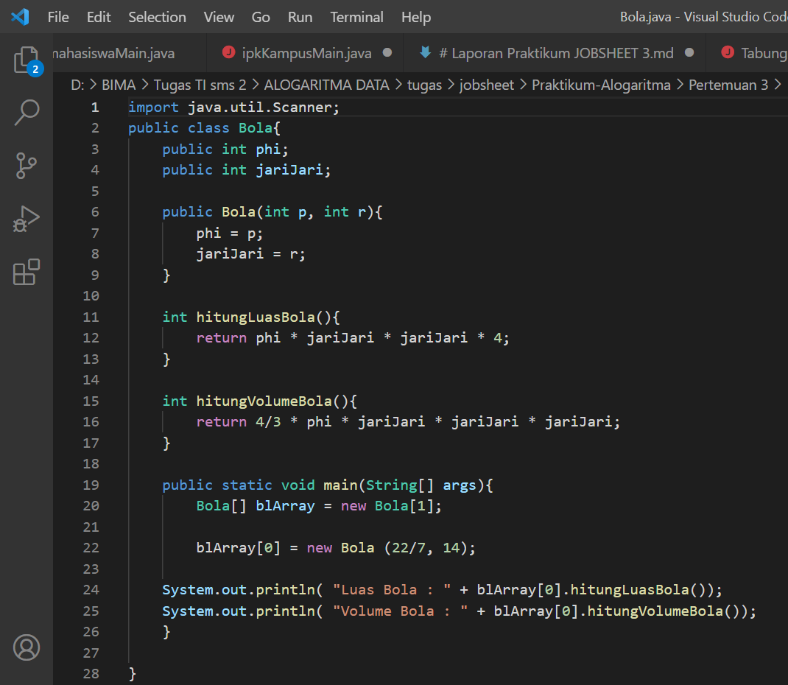
tabung
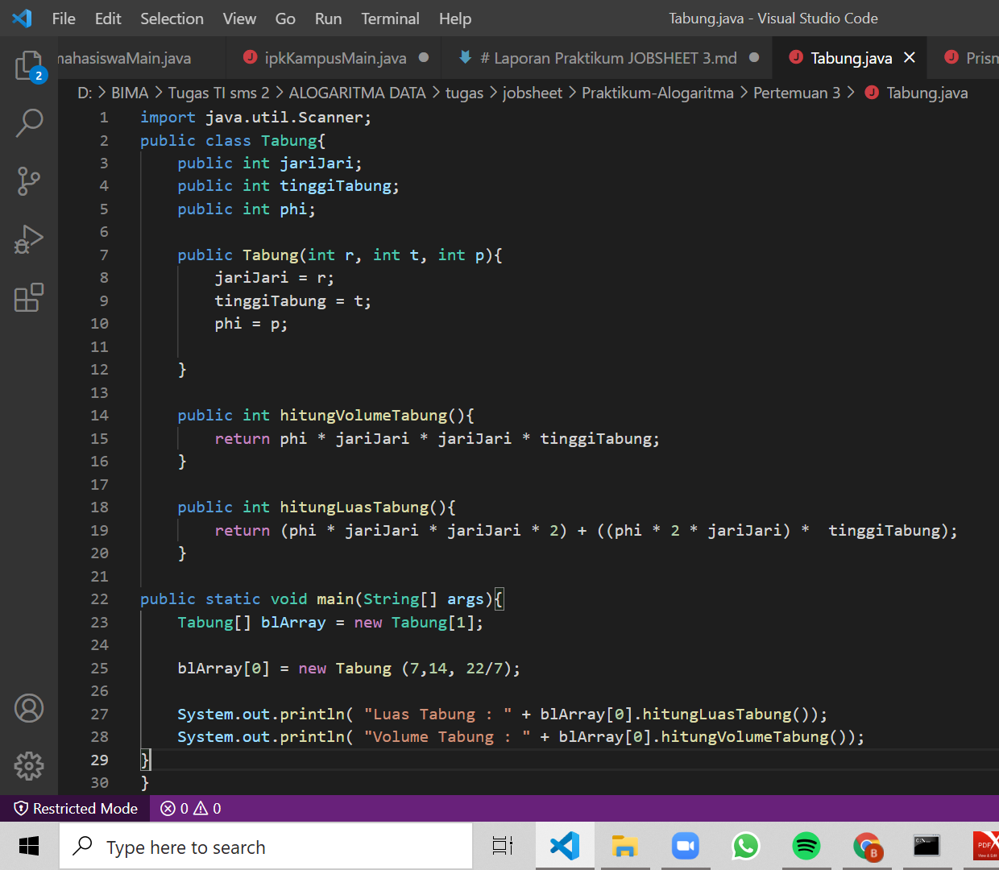
prisma trapesium
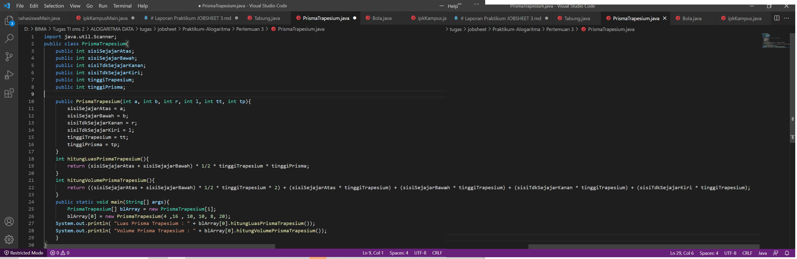

### Hasil Run Program

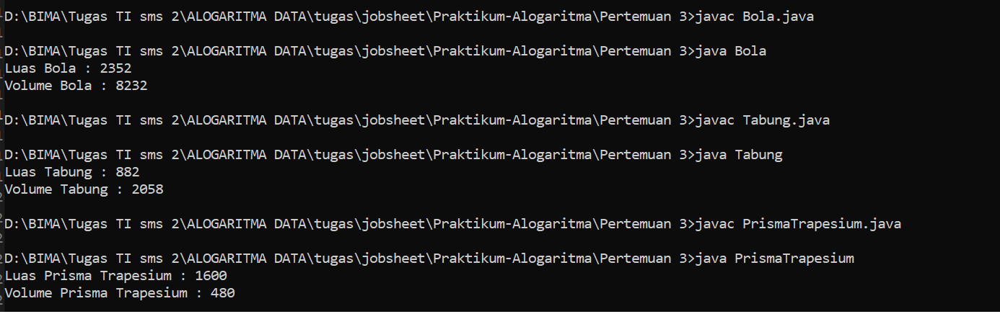

### 2. Kode Program 

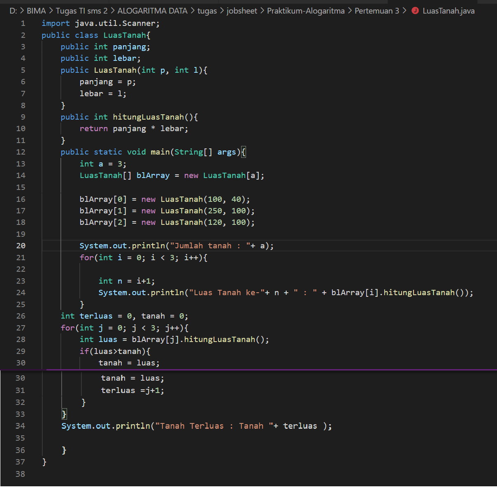

### Hasil Run Program

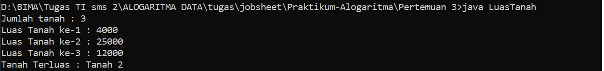

### 3. Kode Program 

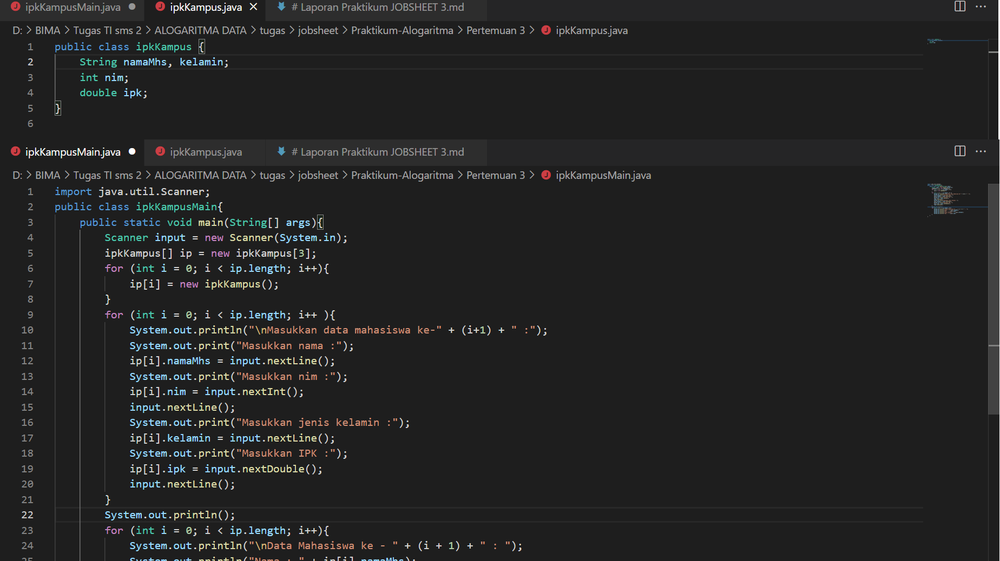

### Hasil Run Program

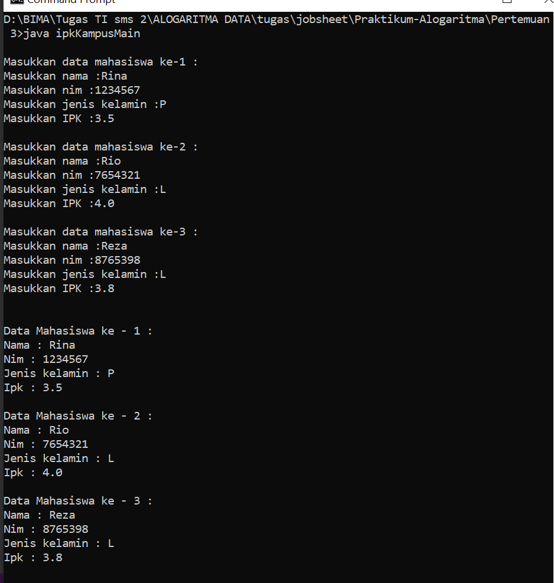